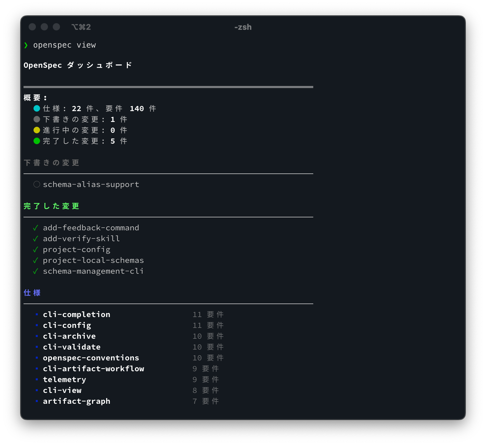

<p align="center">
  <a href="https://github.com/Fission-AI/OpenSpec">
    <picture>
      <source srcset="assets/openspec_pixel_dark.svg" media="(prefers-color-scheme: dark)">
      <source srcset="assets/openspec_pixel_light.svg" media="(prefers-color-scheme: light)">
      
    </picture>
  </a>
  
</p>
<p align="center">AI コーディングアシスタントのための仕様駆動開発。</p>
<p align="center">
  <a href="https://github.com/Fission-AI/OpenSpec/actions/workflows/ci.yml"></a>
  <a href="https://www.npmjs.com/package/@fission-ai/openspec"></a>
  <a href="https://nodejs.org/"></a>
  <a href="./LICENSE"></a>
  <a href="https://conventionalcommits.org"></a>
  <a href="https://discord.gg/YctCnvvshC"></a>
</p>

<p align="center">
  
</p>

<p align="center">
  Follow <a href="https://x.com/0xTab">@0xTab on X</a> for updates · Join the <a href="https://discord.gg/YctCnvvshC">OpenSpec Discord</a> for help and questions.
</p>

# OpenSpec

このリポジトリは、[Fission-AI/OpenSpec](https://github.com/Fission-AI/OpenSpec) をベースにした日本語ローカライズ版（OpenSpec-J）です。仕様と構成は本家を尊重しつつ、日本語利用者向けにドキュメントとメッセージを最適化しています。

OpenSpec は、仕様駆動開発で人と AI コーディングアシスタントをそろえ、コードを書く前に「何を作るか」を合意できるようにします。**API キーは不要です。**

## なぜ OpenSpec か

AI コーディングアシスタントは強力ですが、要件がチャット履歴に散らばると結果が予測しづらくなります。OpenSpec は軽量な仕様ワークフローを追加し、実装前に意図を確定させることで、レビューしやすく再現性のある成果を得られます。

得られる効果:
- 作業前に人と AI が仕様に合意する。
- 提案・タスク・仕様差分がまとまった「変更フォルダー」でスコープを明確化・監査可能にする。
- 提案中・進行中・アーカイブ済みの状態を共有で見渡せる。
- 既存の AI ツールと連携：対応ツールではスラッシュコマンド、その他はコンテキストルールで利用。

## OpenSpec の特徴（ざっくり比較）

- **軽量**: シンプルなワークフロー、API キー不要、最小セットアップ。
- **既存コード重視**: 0→1 だけでなく既存機能の改修にも強い。`openspec/specs/`（現在の真実）と `openspec/changes/`（提案中の更新）を分離し、機能間の差分を明示的に管理。
- **変更追跡**: 提案・タスク・仕様差分を同居させ、アーカイブ時に承認済みの更新を仕様へ統合。
- **spec-kit / Kiro との比較**: これらは 0→1 の新機能で強いが、OpenSpec は既存挙動を変える 1→n 改修や複数仕様にまたがる更新でも力を発揮。

詳細は [How OpenSpec Compares](#how-openspec-compares) を参照してください。

## 仕組み

```
┌────────────────────┐
│ 変更提案ドラフト（下書き） │
│ (Draft Change)     │
└────────┬───────────┘
         │ AI と意図を共有
         ▼
┌────────────────────┐
│ レビューと合意       │
│ (仕様・タスク編集)   │◀──── フィードバックループ ─┐
└────────┬───────────┘                          │
         │ 承認済み計画                          │
         ▼                                      │
┌────────────────────┐                          │
│ タスク実装          │──────────────────────────┘
│ (AI がコードを書く) │
└────────┬───────────┘
         │ 変更をリリース
         ▼
┌────────────────────┐
│ アーカイブと仕様更新 │
│ (ソースの仕様)       │
└────────────────────┘

1. 望む仕様更新を記述した変更提案をドラフト（下書き）する。
2. AI アシスタントとレビューし、合意が取れるまで調整する。
3. 合意済み仕様を参照しながらタスクを実装する。
4. 変更をアーカイブし、承認済みの更新をソース・オブ・トゥルースの仕様に統合する。
```

※ ソース・オブ・トゥルース（source of truth）は、その時点で「正」とみなされる唯一の仕様群を指します。OpenSpec では `openspec/specs/` 配下の仕様ファイルが該当し、承認済みの変更だけがここに反映されます。

## はじめ方

### 対応 AI ツール

<details>
<summary><strong>ネイティブのスラッシュコマンド</strong>（クリックで展開）</summary>

これらのツールには OpenSpec コマンドが組み込まれています。案内に従って OpenSpec 連携を選択してください。

| Tool | Commands |
|------|----------|
| **Amazon Q Developer** | `@openspec-proposal`, `@openspec-apply`, `@openspec-archive` (`.amazonq/prompts/`) |
| **Antigravity** | `/openspec-proposal`, `/openspec-apply`, `/openspec-archive` (`.agent/workflows/`) |
| **Auggie (Augment CLI)** | `/openspec-proposal`, `/openspec-apply`, `/openspec-archive` (`.augment/commands/`) |
| **Claude Code** | `/openspec:proposal`, `/openspec:apply`, `/openspec:archive` |
| **Cline** | Workflows in `.clinerules/workflows/` directory (`.clinerules/workflows/openspec-*.md`) |
| **CodeBuddy Code (CLI)** | `/openspec:proposal`, `/openspec:apply`, `/openspec:archive` (`.codebuddy/commands/`) — see [docs](https://www.codebuddy.ai/cli) |
| **Codex** | `/openspec-proposal`, `/openspec-apply`, `/openspec-archive` (global: `~/.codex/prompts`, auto-installed) |
| **CoStrict** | `/openspec-proposal`, `/openspec-apply`, `/openspec-archive` (`.cospec/openspec/commands/`) — see [docs](https://costrict.ai)|
| **Crush** | `/openspec-proposal`, `/openspec-apply`, `/openspec-archive` (`.crush/commands/openspec/`) |
| **Cursor** | `/openspec-proposal`, `/openspec-apply`, `/openspec-archive` |
| **Factory Droid** | `/openspec-proposal`, `/openspec-apply`, `/openspec-archive` (`.factory/commands/`) |
| **Gemini CLI** | `/openspec:proposal`, `/openspec:apply`, `/openspec:archive` (`.gemini/commands/openspec/`) |
| **GitHub Copilot** | `/openspec-proposal`, `/openspec-apply`, `/openspec-archive` (`.github/prompts/`) |
| **iFlow (iflow-cli)** | `/openspec-proposal`, `/openspec-apply`, `/openspec-archive` (`.iflow/commands/`) |
| **Kilo Code** | `/openspec-proposal.md`, `/openspec-apply.md`, `/openspec-archive.md` (`.kilocode/workflows/`) |
| **OpenCode** | `/openspec-proposal`, `/openspec-apply`, `/openspec-archive` |
| **Qoder (CLI)** | `/openspec:proposal`, `/openspec:apply`, `/openspec:archive` (`.qoder/commands/openspec/`) — see [docs](https://qoder.com/cli) |
| **Qwen Code** | `/openspec-proposal`, `/openspec-apply`, `/openspec-archive` (`.qwen/commands/`) |
| **RooCode** | `/openspec-proposal`, `/openspec-apply`, `/openspec-archive` (`.roo/commands/`) |
| **Windsurf** | `/openspec-proposal`, `/openspec-apply`, `/openspec-archive` (`.windsurf/workflows/`) |

Kilo Code はチームのワークフローを自動検出します。生成されたファイルを `.kilocode/workflows/` に保存し、コマンドパレットから `/openspec-proposal.md`、`/openspec-apply.md`、`/openspec-archive.md` を実行してください。

</details>

<details>
<summary><strong>AGENTS.md 互換</strong>（クリックで展開）</summary>

これらのツールは `openspec/AGENTS.md` からワークフロー手順を自動で読み込みます。必要に応じて OpenSpec ワークフローを実行するよう指示してください。詳細は [AGENTS.md convention](https://agents.md/) を参照。

| Tools |
|-------|
| Amp • Jules • Others |

</details>

### インストールと初期化

#### 前提条件
- **Node.js >= 20.19.0** - `node --version` で確認してください。

#### ステップ 1: CLI をグローバルインストール

```bash
npm install -g @fission-ai/openspec@latest
```

Verify installation:
```bash
openspec --version
```

#### ステップ 2: プロジェクトで OpenSpec を初期化

プロジェクトディレクトリへ移動:
```bash
cd my-project
```

初期化コマンドを実行:
```bash
openspec init
```

**初期化で行われること:**
- 対応 AI ツール（Claude Code, CodeBuddy, Cursor, OpenCode, Qoder など）の選択を促されます。それ以外のアシスタントは共有の `AGENTS.md` を参照します。
- 選んだツール向けのスラッシュコマンドを自動設定し、ルートに管理対象の `AGENTS.md` を配置します。
- プロジェクト内に `openspec/` ディレクトリ構造が作成されます。

**セットアップ後:**
- 対応 AI ツールは追加設定なしで `/openspec` ワークフローを呼び出せます。
- `openspec list` を実行し、セットアップ確認とアクティブな変更の一覧を確認します。
- スラッシュコマンドがすぐに表示されない場合は、アシスタントを再起動してください。起動時にコマンドが読み込まれます。

### Optional: Populate Project Context

`openspec init` 完了後、プロジェクトコンテキストを埋めるための推奨プロンプトが提示されます:

```text
Populate your project context:
"Please read openspec/project.md and help me fill it out with details about my project, tech stack, and conventions"
```

`openspec/project.md` には、プロジェクト共通の規約・標準・アーキテクチャパターン・ガイドラインなどを記載してください。

### 最初の変更を作成する

以下は OpenSpec のワークフロー全体を示す実例です。どの AI ツールでも機能し、対応ツールならショートカットを自動認識します。

#### 1. 提案を書き出す
AI に変更提案の作成を依頼します:

```text
You: Create an OpenSpec change proposal for adding profile search filters by role and team
     (Shortcut for tools with slash commands: /openspec:proposal Add profile search filters)

AI:  I'll create an OpenSpec change proposal for profile filters.
     *Scaffolds openspec/changes/add-profile-filters/ with proposal.md, tasks.md, spec deltas.*
```

#### 2. 確認とレビュー
変更が正しく作成されたか確認し、提案をレビューします:

```bash
$ openspec list                             # Confirm the change folder exists
$ openspec validate add-profile-filters     # Validate spec formatting
$ openspec show add-profile-filters         # Review proposal, tasks, and spec delta
```

#### 3. 仕様を磨き込む
必要な状態になるまで仕様を調整します:

```text
You: Can you add acceptance criteria for the role and team filters?

AI:  I'll update the spec delta with scenarios for role and team filters.
     *Edits openspec/changes/add-profile-filters/specs/profile/spec.md and tasks.md.*
```

#### 4. 変更を実装する
仕様が固まったら実装を始めます:

```text
You: The specs look good. Let's implement this change.
     (Shortcut for tools with slash commands: /openspec:apply add-profile-filters)

AI:  I'll work through the tasks in the add-profile-filters change.
     *Implements tasks from openspec/changes/add-profile-filters/tasks.md*
     *Marks tasks complete: Task 1.1 ✓, Task 1.2 ✓, Task 2.1 ✓...*
```

#### 5. 完了した変更をアーカイブする
実装完了後、変更をアーカイブします:

```text
AI:  All tasks are complete. The implementation is ready.

You: Please archive the change
     (Shortcut for tools with slash commands: /openspec:archive add-profile-filters)

AI:  I'll archive the add-profile-filters change.
    *Runs: openspec archive add-profile-filters --yes*
     ✓ Change archived successfully. Specs updated. Ready for the next feature!
```

Or run the command yourself in terminal:
```bash
$ openspec archive add-profile-filters --yes  # Archive the completed change without prompts
```

**補足:** スラッシュコマンド対応ツール（Claude Code, CodeBuddy, Cursor, Codex, Qoder, RooCode など）は上記ショートカットをそのまま使用できます。その他のツールでも「OpenSpec の提案を作成」「OpenSpec の変更を適用」「変更をアーカイブ」と自然文で依頼すれば動作します。

## コマンドリファレンス

```bash
openspec list               # View active change folders
openspec view               # Interactive dashboard of specs and changes
openspec show <change>      # Display change details (proposal, tasks, spec updates)
openspec validate <change>  # Check spec formatting and structure
openspec archive <change> [--yes|-y]   # Move a completed change into archive/ (non-interactive with --yes)
```

## 例: AI が OpenSpec ファイルを生成する流れ

AI に「二要素認証を追加して」と依頼すると、次のように生成します:

```
openspec/
├── specs/
│   └── auth/
│       └── spec.md           # Current auth spec (if exists)
└── changes/
    └── add-2fa/              # AI creates this entire structure
        ├── proposal.md       # Why and what changes
        ├── tasks.md          # Implementation checklist
        ├── design.md         # Technical decisions (optional)
        └── specs/
            └── auth/
                └── spec.md   # Delta showing additions
```

### 生成される仕様 (`openspec/specs/auth/spec.md`)

```markdown
# Auth Specification

## Purpose
Authentication and session management.

## Requirements
### Requirement: User Authentication
The system SHALL issue a JWT on successful login.

#### Scenario: Valid credentials
- WHEN a user submits valid credentials
- THEN a JWT is returned
```

### 生成される変更差分 (`openspec/changes/add-2fa/specs/auth/spec.md`)

```markdown
# Delta for Auth

## ADDED Requirements
### Requirement: Two-Factor Authentication
The system MUST require a second factor during login.

#### Scenario: OTP required
- WHEN a user submits valid credentials
- THEN an OTP challenge is required
```

### 生成されるタスク (`openspec/changes/add-2fa/tasks.md`)

```markdown
## 1. Database Setup
- [ ] 1.1 Add OTP secret column to users table
- [ ] 1.2 Create OTP verification logs table

## 2. Backend Implementation  
- [ ] 2.1 Add OTP generation endpoint
- [ ] 2.2 Modify login flow to require OTP
- [ ] 2.3 Add OTP verification endpoint

## 3. Frontend Updates
- [ ] 3.1 Create OTP input component
- [ ] 3.2 Update login flow UI
```

**重要:** これらのファイルを手作業で作る必要はありません。要件と既存コードに基づき、AI アシスタントが自動生成します。

## OpenSpec ファイルの理解

### 差分フォーマット

差分は仕様がどのように変わるかを示す「パッチ」です:

- **`## ADDED Requirements`** - 新しい機能
- **`## MODIFIED Requirements`** - 挙動変更（更新後の全文を記載）
- **`## REMOVED Requirements`** - 廃止する機能

**フォーマット要件:**
- 見出しは `### Requirement: <name>`
- 各要件に少なくとも 1 つの `#### Scenario:` ブロックが必要
- 要件文では SHALL/MUST を使用

## OpenSpec の比較

### spec-kit との比較
OpenSpec の 2 フォルダモデル（現在の真実は `openspec/specs/`、提案中の更新は `openspec/changes/`）で状態と差分を分離します。既存機能の改修や複数仕様にまたがる更新でもスケールしやすく、spec-kit が得意とする 0→1 の新規開発よりも既存機能の進化に強みがあります。

### Kiro.dev との比較
OpenSpec は機能ごとの変更を 1 フォルダ（`openspec/changes/feature-name/`）にまとめ、関連する仕様・タスク・設計を一括で追跡できます。Kiro は更新が複数仕様フォルダに分散しやすく、機能単位の追跡が難しくなりがちです。

### 仕様なしの場合
仕様がないと、AI はあいまいなプロンプトからコードを生成し、要件抜けや不要機能が生まれがちです。OpenSpec はコードを書く前に望む挙動への合意を作り、予測可能性をもたらします。

## チーム導入

1. **OpenSpec を初期化** – リポジトリで `openspec init` を実行。
2. **新機能から始める** – 近々の作業を変更提案として AI にまとめてもらう。
3. **段階的に拡張** – 各変更をアーカイブし、仕様としてシステムドキュメントを育てる。
4. **柔軟性を維持** – メンバーは Claude Code、CodeBuddy、Cursor、AGENTS.md 互換ツールなど好きなアシスタントを使いつつ、同じ仕様を共有できる。

メンバーがツールを切り替えたら `openspec update` を実行し、最新の手順とスラッシュコマンド設定を反映させてください。

## OpenSpec のアップデート

1. **パッケージをアップグレード**
   ```bash
   npm install -g @fission-ai/openspec@latest
   ```
2. **エージェントの手順を更新**
- 各プロジェクトで `openspec update` を実行し、AI ガイダンスとスラッシュコマンドを最新化します。

## コントリビュート

- 依存をインストール: `pnpm install`
- ビルド: `pnpm run build`
- テスト: `pnpm test`
- CLI ローカル開発: `pnpm run dev` または `pnpm run dev:cli`
- Conventional Commits（1 行）: `type(scope): subject`

## ライセンス

MIT
