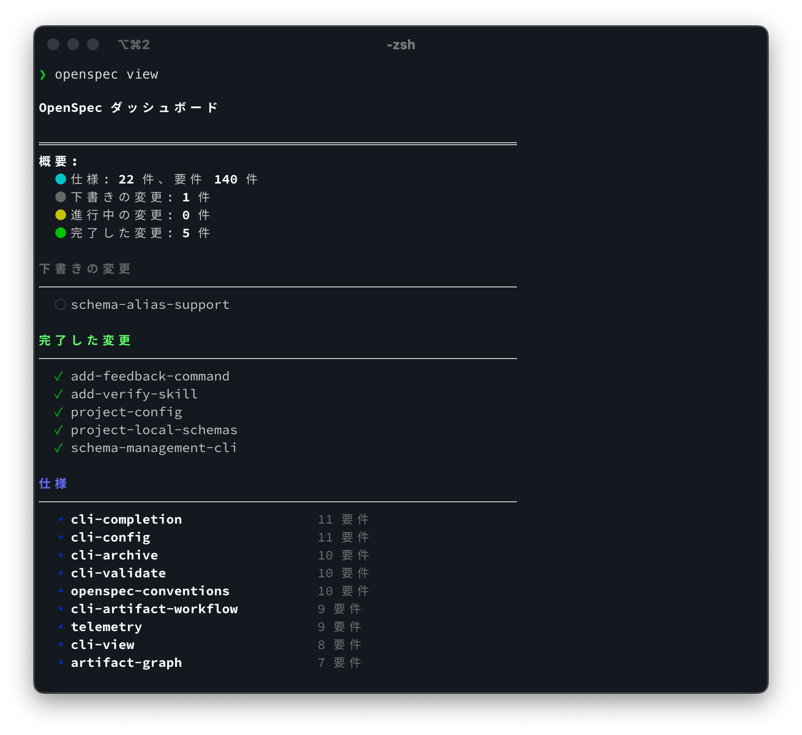

<p align="center">
  <a href="https://github.com/Fission-AI/OpenSpec">
    <picture>
      <source srcset="assets/openspec_bg.png">
      
    </picture>
  </a>
</p>

<p align="center">
<a href="https://github.com/Fission-AI/OpenSpec/actions/workflows/ci.yml"></a>
<a href="https://www.npmjs.com/package/@ayumuwall/openspec"></a>
<a href="./LICENSE"></a>
<a href="https://discord.gg/YctCnvvshC"></a>
</p>

> [!NOTE]
> このリポジトリは、Fission-AI/OpenSpec をベースにした日本語ローカライズ版（[OpenSpec-J](https://github.com/ayumuwall/OpenSpec-J)）です。仕様と構成は本家を尊重しつつ、日本語利用者向けにドキュメントとメッセージを最適化しています。**現在の同期元は OpenSpec v1.6.0 です。**<br>
> 生成物だけ日本語にできれば十分な場合は、本家版の [Multi-Language](docs/multi-language.md) を利用できます。

<details>
<summary><strong>最も愛されている仕様フレームワーク。</strong></summary>

[](https://github.com/Fission-AI/OpenSpec/stargazers)
[](https://www.npmjs.com/package/@ayumuwall/openspec)
[](https://github.com/Fission-AI/OpenSpec/graphs/contributors)

</details>
<p></p>
私たちの哲学:

```text
→ 固定的ではなく柔軟に
→ ウォーターフォールではなく反復的に
→ 複雑ではなく扱いやすく
→ 新規開発だけでなく既存コードベースにも対応
→ 個人プロジェクトからエンタープライズまで拡張可能
```

> [!TIP]
> **新しいワークフローが利用可能になりました!** 新しいアーティファクトに基づいたワークフローを使用して OpenSpec を再構築しました。
>
> `/opsx:propose "あなたのアイデア"` を実行して開始します。 → [詳しくはこちら](docs/opsx.md)

<p align="center">
最新情報については、<a href="https://x.com/0xTab">@0xTab on X</a> をフォローしてください。ヘルプや質問については、<a href="https://discord.gg/YctCnvvshC">OpenSpec Discord</a> に参加してください。
</p>

<!-- TODO: Add GIF demo of /opsx:propose → /opsx:archive workflow -->

## 実際の流れ

```text
You: /opsx:explore
AI:  何を調べたいですか？
You: ダークモードを入れたいけれど、きれいな実装方法がまだ分かりません。
AI:  スタイル周りの構成を確認します...
     ここでは CSS 変数と小さなテーマコンテキストを使い、
     システム設定の検出を加えるのが一番素直です。
     新しい依存関係は不要です。この範囲で進めますか？
You: はい、それで進めましょう。

You: /opsx:propose add-dark-mode
AI:  openspec/changes/add-dark-mode/ を作成しました
     ✓ proposal.md — 目的と変更内容
     ✓ specs/       — 要件とシナリオ
     ✓ design.md    — 技術的な方針
     ✓ tasks.md     — 実装チェックリスト
     実装に進めます。

You: /opsx:apply
AI:  タスクを実装しています...
     ✓ 1.1 テーマコンテキストプロバイダーを追加
     ✓ 1.2 トグルコンポーネントを作成
     ✓ 2.1 CSS 変数を追加
     ✓ 2.2 localStorage と連携
     すべてのタスクが完了しました。

You: /opsx:archive
AI:  openspec/changes/archive/2025-01-23-add-dark-mode/ にアーカイブしました
     仕様を更新しました。次の機能に進めます。
```

<details>
<summary><strong>仕様は実際にどのような形式ですか？</strong></summary>

特別な構文を覚える必要はありません。具体的なシナリオを含む要件を、通常のMarkdownで記述します。上で作成した `specs/` フォルダーには、次のような内容が入ります。

```markdown
## ADDED Requirements

### Requirement: テーマ選択
アプリは、システム設定をデフォルトとして、
ライトテーマとダークテーマを切り替えられるものとする（SHALL）。

#### Scenario: ユーザーがダークモードへ切り替える
- **WHEN** ユーザーがテーマ切り替えをクリックする
- **THEN** アプリはダークモードへ切り替え、選択を保存する
```

AIがこれらを作成し、コードを書く前にあなたが計画をレビューします。

OpenSpec自身もOpenSpecを使って開発されています。実際の大規模な例として、このリポジトリの[仕様](openspec/specs)と進行中の[変更](openspec/changes)を参照できます。

</details>

<details>
<summary><strong>OpenSpec ダッシュボード</strong></summary>

<p align="center">
  
</p>

</details>

## チームで OpenSpec を使う理由

個人利用では、OpenSpec は 1 つのリポジトリ上で人間と AI の認識をそろえます。チームでは、難しさの中心が変わります。機能は API サーバー、Web アプリ、共有ライブラリにまたがります。要件を所有するチームと、それを利用するチームが分かれることもあります。計画は、コードが存在する前から始まります。

そのための仕組みが **[Stores](docs/stores-beta/user-guide.md)** です。計画を専用リポジトリに置き、すでに見慣れた `openspec/` の構造（仕様と変更）を `git push` で共有します。複数リポジトリにまたがる作業でも、チーム全体とすべてのコーディングエージェントが読める、信頼できる 1 つの情報源を持てます。

- **クロスリポジトリ機能** — コードが 3 つのリポジトリにある場合でも、1 つの変更、1 つの計画。
- **共有要件** — プラットフォームチームが仕様を所有し、製品チームはコーディングエージェントが読める場所から読み取り専用で参照します。Wiki と実装がずれていく状態を避けられます。
- **コードの前に計画を立てる** — まずストアに計画を置き、コードリポジトリは後から追従できます。

> ストアは **ベータ版** です。まずは [Stores ユーザーガイド](docs/stores-beta/user-guide.md) を参照してください。

<a id="quick-start"></a>

## クイックスタート

**Node.js 20.19.0 以降が必要です。**

OpenSpec をグローバルにインストールします。

```bash
npm install -g @ayumuwall/openspec@latest
```

次に、プロジェクトディレクトリに移動して初期化します。

```bash
cd your-project
openspec init
```

> **AIに任せたい場合は、** [セットアップ用プロンプト](docs/installation.md#aiアシスタントでインストール)をコーディングアシスタントへ貼り付けてください。CLIのインストール、`openspec init` の実行、結果の確認まで行います。

次にAIへ話しかけます。

- **まだ何を作るべきか固まっていませんか?** `/opsx:explore` から始めてください。コードを読み、選択肢を比べ、何かを書く前に計画の形へ整理してくれる安全な相談相手です。([探索ガイド](docs/explore.md))
- **欲しいものはもう決まっていますか?** `/opsx:propose <what-you-want-to-build>` へ直接進んでください。

どちらもデフォルトのプロファイルに含まれています。拡張ワークフロー（`/opsx:new`、`/opsx:continue`、`/opsx:ff`、`/opsx:verify`、`/opsx:bulk-archive`、`/opsx:onboard`）が必要な場合は、`openspec config profile`で選択し、`openspec update`で適用します。

`/opsx:propose` is the canonical name; your tool may spell it `/opsx-propose` (Cursor, GitHub Copilot), `@opsx-propose` (Amazon Q) or `$openspec-propose` (Codex). `openspec init` prints the right form for the tools you picked — see [How To Invoke](docs/supported-tools.md#how-to-invoke).

> [!NOTE]
> 使用しているツールが対応しているか不明ですか？[完全な一覧](docs/supported-tools.md)を参照してください。30以上のツールに対応し、今後も追加していきます。
>
> pnpm、yarn、bun、nix でも動作します。 [インストールオプション](docs/installation.md)を参照してください。

## ドキュメント

**ここから始めてください:** **[ドキュメントホーム](docs/README.md)** に全体像をまとめています。OpenSpec が初めてなら、まず [はじめに](docs/getting-started.md) を読み、次に [コマンドの仕組み](docs/how-commands-work.md) で `/opsx:propose` をどこに入力するか確認してください。

→ **[はじめに](docs/getting-started.md)**: 最初のステップ<br>
→ **[まずは探索する](docs/explore.md)**: コミットする前に `/opsx:explore` で考えを整理する<br>
→ **[コマンドの仕組み](docs/how-commands-work.md)**: スラッシュコマンドを実行する場所と CLI との違い<br>
→ **[コアコンセプトの概要](docs/overview.md)**: メンタルモデル全体、1 ページ<br>
→ **[例とレシピ](docs/examples.md)**: 実際の変更の開始から終了まで<br>
→ **[ワークフロー](docs/workflows.md)**: コンボとパターン<br>
→ **[既存プロジェクト](docs/existing-projects.md)**: ブラウンフィールドのコードベースに OpenSpec を導入する<br>
→ **[変更の編集](docs/editing-changes.md)**: アーティファクトの更新、戻り作業、手動編集との整合<br>
→ **[コマンド](docs/commands.md)**: スラッシュコマンドとスキル<br>
→ **[CLI](docs/cli.md)**: 端末リファレンス<br>
→ **[Stores](docs/stores-beta/user-guide.md)**: 別のリポジトリで計画し、チーム全体で共有します (ベータ版)<br>
→ **[サポートされているツール](docs/supported-tools.md)**: ツール統合とインストール先<br>
→ **[コンセプト](docs/concepts.md)**: それぞれの要素がどうつながるか<br>
→ **[多言語](docs/multi-language.md)**: 多言語サポート<br>
→ **[カスタマイズ](docs/customization.md)**: 自分の環境に合わせる<br>
→ **[FAQ](docs/faq.md)** · **[トラブルシューティング](docs/troubleshooting.md)** · **[用語集](docs/glossary.md)**: クイックヘルプ


## コミュニティスキーマ

スタンドアロンリポジトリ経由で配布されるサードパーティのスキーマバンドルです。[github/spec-kit のコミュニティ拡張カタログ](https://github.com/github/spec-kit/tree/main/extensions) がツール統合を扱うのと同じように、OpenSpec を他のツールと連携させるための独自ワークフローを提供します。

→ **[カスタマイズドキュメントのカタログ](docs/customization.md#community-schemas)**を参照してください。


## なぜ OpenSpec を使うのか?

AI コーディングアシスタントは強力ですが、要件がチャット履歴にしか残らない場合、結果は予測しにくくなります。OpenSpec は軽量な仕様レイヤーを追加し、コードを書く前に何を作るか合意できるようにします。

- **構築する前に合意する** — コードを書く前に人間と AI が仕様をすり合わせます
- **整理しやすい** — 変更ごとに、提案、仕様、設計、タスクを含む専用フォルダーが作成されます
- **流動的に作業** — 厳格なフェーズ ゲートを使用せず、いつでもアーティファクトを更新できます
- **普段のツールで使える** — スラッシュコマンドを通じて 30 以上の AI アシスタントと連携します

### 比較方法

**vs. [Spec Kit](https://github.com/github/spec-kit)** (GitHub) — 徹底的ですが重量級です。厳格なフェーズゲート、大量の Markdown、Python セットアップが必要です。OpenSpec は軽量で、自由に反復できます。

**vs. [Kiro](https://kiro.dev)** (AWS) — 強力ですが、IDE にロックされており、Claude モデルに限定されています。OpenSpec は、すでに使用しているツールと連携して動作します。

**vs. 何も使わない** — 仕様のない AI コーディングは、曖昧なプロンプトと予測しにくい結果につながります。OpenSpec は、重い手続きを増やさずに予測可能性を高めます。

## OpenSpec の更新

**パッケージをアップグレードします**

```bash
npm install -g @ayumuwall/openspec@latest
```

**エージェントの指示を更新します**

各プロジェクト内でこれを実行して AI ガイダンスを再生成し、最新のスラッシュコマンドが有効になっていることを確認します。

```bash
openspec update
```

## 使用上の注意

**モデルの選択**: OpenSpec は高度な推論モデルで最もよく機能します。計画と実装の両方に Codex 5.5 と Opus 4.7 をお勧めします。

**コンテキスト管理**: OpenSpec は、クリーンなコンテキストウィンドウで使うと効果を発揮しやすくなります。実装を始める前にコンテキストを整理し、セッション中も不要な情報を持ち込みすぎないようにしてください。

## 貢献する

**小さな修正** — バグ修正、タイプミスの修正、および軽微な改善は PR として直接送信できます。

**大規模な変更** — 新機能、重要なリファクタリング、またはアーキテクチャの変更については、実装を開始する前に意図と目標を調整できるよう、まず OpenSpec の変更提案を提出してください。

提案書を作成するときは、OpenSpec の哲学を念頭に置いてください。私たちは、さまざまなコーディングエージェント、モデル、ユースケースを使う幅広いユーザーに向けて OpenSpec を作っています。変更は、特定の環境だけでなく多くの利用者にとってうまく機能するべきです。

**AI によって生成されたコードは歓迎されます** — テストと検証が行われている限り。AI 生成コードを含む PR では、使用したコーディングエージェントとモデルを明記してください（例: 「Claude Code で claude-opus-4-5-20251101 を使用して生成」）。

### 開発

- 依存関係のインストール: `pnpm install`
- ビルド: `pnpm run build`
- テスト: `pnpm test`
- CLI をローカルで開発: `pnpm run dev` または `pnpm run dev:cli`
- Conventional Commit (1 行): `type(scope): subject`

## その他

<details>
<summary><strong>テレメトリー</strong></summary>

OpenSpec は匿名の使用状況統計を収集します。

使用パターンを理解するために、コマンド名とバージョンのみを収集します。引数、パス、コンテンツ、PII はありません。 CI では自動的に無効になります。

**オプトアウト:** `export OPENSPEC_TELEMETRY=0` または `export DO_NOT_TRACK=1`

</details>

<details>
<summary><strong>メンテナとアドバイザー</strong></summary>

プロジェクトの方向づけを支援するコアメンテナーとアドバイザーのリストについては、[MAINTAINERS.md](MAINTAINERS.md) を参照してください。

</details>


## ライセンス

MIT
