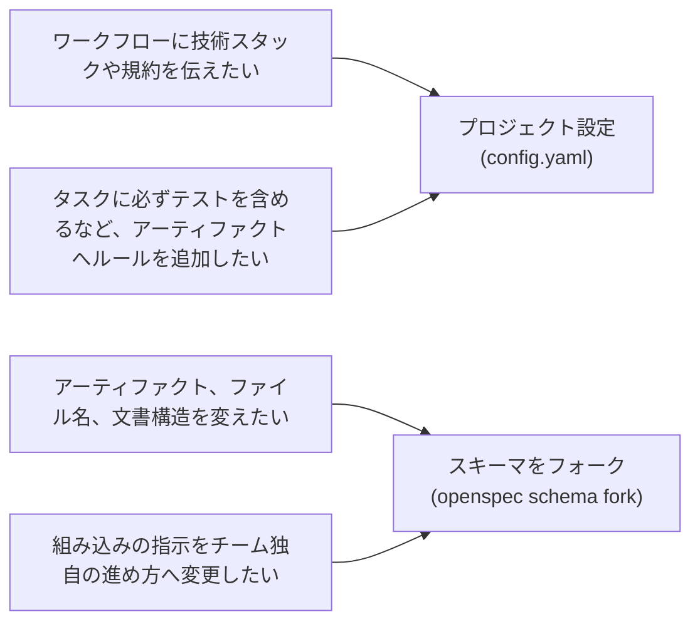

# 概要

> OpenSpec をカスタマイズする方法を紹介します。

OpenSpec には複数のカスタマイズ方法があります。このページでは、それぞれで何を変更でき、どのような場合に使うかを説明します。

## カスタマイズできる項目

| オプション                            | 変更するもの                                                                             | 使う場面                                                                                 |
| ------------------------------------- | ---------------------------------------------------------------------------------------- | ---------------------------------------------------------------------------------------- |
| [プロファイル](profiles.md)           | インストールするワークフローと、スキル、コマンド、その両方のどの形式でインストールするか | ワークフローや作業手順を追加したい場合、または不要なワークフローを削除したい場合         |
| [プロジェクト設定](project-config.md) | すべてのワークフロー実行へ追加するコンテキスト、ルール、操作ごとの指示（`config.yaml`）  | タスクに必ず Playwright テストを含めるなど、プロジェクト独自の方法で変更を計画したい場合 |
| [スキーマ](schemas.md)                | OpenSpec が生成するアーティファクト、その順序、テンプレート                              | 生成する計画ファイル、セクション、形式を変えたい場合                                     |

## どれを使えばいいか分からない場合

プロジェクト設定とスキーマでは、カスタマイズできる深さが異なります。どこまで手を加えたいかで選んでください。

- **まずは[プロジェクト設定](project-config.md)を使う**：手軽で、ほとんどのプロジェクトにはこれで十分です。標準のアーティファクトを維持したまま、独自のコンテキストやルールを追加できます。
- **追加だけでは足りない場合は[スキーマ](schemas.md)をフォークする**：プロジェクト設定では、基本ワークフローに情報を追加することしかできません。「タスクには必ずテストを含める」というルールは追加できますが、設計書をなくしたり、ファイル名を変えたりはできません。そのような変更にはスキーマを使います。フォークすると、自由に編集できる独自のコピーが作られます。

_ここでいうフォークは、Git リポジトリのフォークではなく、`openspec schema fork`コマンドを指します。詳しくは[スキーマ](schemas.md)を参照してください。_

